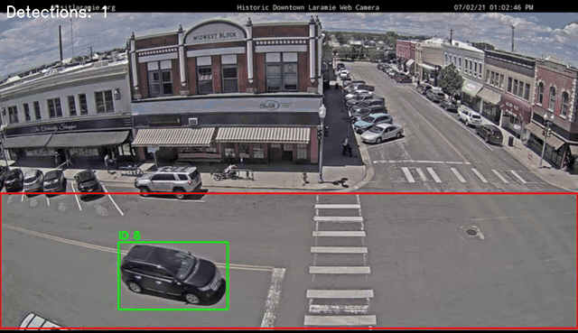
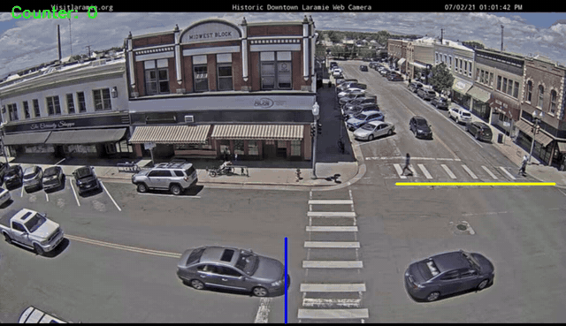
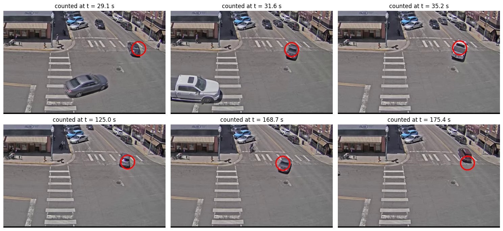

# Traffic Car Detection, Tracking and Counting

Detecting, tracking and counting cars in traffic-camera footage from Laramie, Wyoming, with classical computer vision only (OpenCV, no machine learning).

<table>
  <tr>
    <td width="50%"></td>
    <td width="50%"></td>
  </tr>
  <tr>
    <td align="center"><sub>Tracking: a box and an ID on every car on the main street</sub></td>
    <td align="center"><sub>Counting: cars that cross the blue gate and then the yellow gate</sub></td>
  </tr>
</table>

| Notebook | What it does | Run it |
|---|---|---|
| [`car_detection_tracking.ipynb`](car_detection_tracking.ipynb) | Detects and tracks the cars on the main street | [](https://colab.research.google.com/github/ziadelh/traffic-car-tracking/blob/main/car_detection_tracking.ipynb) |
| [`car_counting.ipynb`](car_counting.ipynb) | Counts the cars that go from the city centre to downtown | [](https://colab.research.google.com/github/ziadelh/traffic-car-tracking/blob/main/car_counting.ipynb) |

## How it works

**Detection.** Frame differencing finds the pixels that changed since the previous frame, and OpenCV's MOG2 background subtraction finds the pixels that do not belong to the learned background. The two masks are combined and cleaned with morphology, and each blob is kept only if its size, shape, edge density and contrast look like a car. Only the main street is searched. When two cars touch, their blob is **split at the narrow neck between them** with a distance transform, so each car still gets its own box. People and cyclists are ignored: they are smaller than a car and taller than they are wide, and only a car that is just entering at the left or right edge can look that way.

**Tracking.** Every car gets a Kalman filter that predicts where it will be in the next frame. Detections are matched to tracks by overlap and distance. A car that loses its track, for example while it stands next to another car, is picked up again and **gets its old ID back**, a stopped car keeps its track, and two tracks sitting on top of each other are merged into one.

**Counting.** Two virtual gates describe the route from the city centre to downtown: cars come from the left along the main street and cross the **blue gate**, then turn up the side street and cross the **yellow gate**. A car is counted once, when it has crossed the blue gate and then the yellow gate within a time window and has travelled far enough across the frame. The design choices that make the count reliable:

1. The direction filter applies only at the blue gate. A car crossing the yellow gate is turning up the side street and moves steeply, so no direction filter is used there.
2. The yellow gate starts past the crosswalk (0.70 of the frame width), so people and cyclists on the crosswalk are not counted.
3. A car that was split into two tracks crosses the gate twice within a moment, so two counts within one second and 100 pixels of each other are treated as one car.
4. A short memory of recently lost tracks lets a dropped track be picked up again.

## Results

**Tracking.** In the first recording (2.97 minutes, 4,448 frames) the tracker followed every car on the main street with a steady ID, 23 tracks in all. The output was checked every two seconds in both recordings: every car that is fully in view has a box, and a car that has only just entered at the left or right edge gets its box as soon as enough of it is visible.

**Counting.**

| Recording | Cars counted | Cars per minute |
|---|---|---|
| `Traffic_Laramie_1.mp4` | 6 | 2.02 |
| `Traffic_Laramie_2.mp4` | 0 | 0.00 |

Both recordings were also checked by hand: every car that comes from the left and turns up the side street was marked. The first recording has 6 such cars and the counter found all 6 with no false counts. The second has none: its cars either carry on east or turn south, and the ones that do go up the side street come from the right.



## Notes

- This is a classical pipeline with thresholds set for this camera angle. For other cameras or very crowded traffic, a trained detector such as YOLO with a tracker such as DeepSORT is the natural next step.
- Where two cars overlap in the image, their boxes can overlap too. The same settings work on both recordings.

## Run it

Click a Colab badge, or run locally:

```bash
pip install -r requirements.txt
jupyter notebook
```

The two recordings are 111 MB and 66 MB, so they are not stored in the repository: the notebooks download them from the [`data-v1` release](https://github.com/ziadelh/traffic-car-tracking/releases/tag/data-v1) the first time they run. Tracking takes about a minute and counting about two minutes.

## Files

| Path | Purpose |
|---|---|
| `car_detection_tracking.ipynb` | Detection and tracking, with the results saved in the notebook |
| `car_counting.ipynb` | The counter, the check against the hand count and the counted cars |
| `results/` | The counting results as text |
| `docs/` | The clips and pictures used in this README |

## Credits

The two recordings come from the Historic Downtown Laramie web camera (visitlaramie.org) and were supplied with the course.

## Tech Stack

Python · OpenCV · NumPy · pandas · Matplotlib

## Author

Ziad Elhussein
